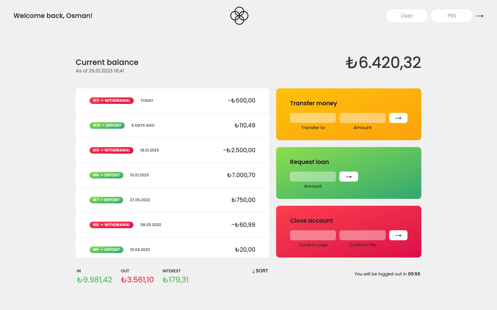

# ⚡️ Bankist App

"Bankist" is a fictional and minimalistic online banking application. This project is from [Jonas Schmedtmann](https://github.com/jonasschmedtmann/complete-javascript-course)'s complete JavaScript course. I am working on this course to improve my JavaScript skills.

I also added some features to the application, such as responsive support and notification alerts.

## 🚀 Demo

You can use the below accounts for testing the application and you can visit the [live demo](https://bankist-app-tangoren.vercel.app/) here.

| #         | User | Pin  |
| --------- | ---- | ---- |
| Account 1 | `js` | 1111 |
| Account 2 | `jd` | 2222 |
| Account 3 | `ot` | 3333 |

## ⭐️ Course features

- Authentication,
- Money transfer between accounts,
- Request loans,
- Movements sorting (ascending/descending),
- Close account (delete),
- Log out timer.

## ❤️ Additional features

- Responsive support
- Toast notifications ([toastify-js](https://github.com/apvarun/toastify-js))
